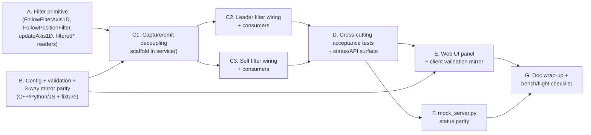

# FormationFlight — Follow Position/Velocity Filtering — Implementation Plan

**Spec:** [`docs/spec/2026-09-14-FollowPositionFiltering.md`](../spec/2026-09-14-FollowPositionFiltering.md)
**Depends on:** nothing unmerged. `ff::FollowController` (`lib/ff_core/follow.h/.cpp`) and its native test suite (`test/test_follow/`) are live on this branch today; the speed-autothrottle fields this spec's follower filter feeds (`speedCorrectionAccelCmS2`, `minTargetSpeedMps`/`maxTargetSpeedMps`) are already implemented. `PATH` mode (`docs/spec/2026-09-08-FollowPathTracking.md`) is **not** implemented — nothing here blocks on it, and nothing it would add blocks this either.
**Status:** Draft for review

This plan sequences the spec into phases that each land with their own tests and docs (per-phase, not deferred to the end), and produce something bench-testable on their own via the host-native suite before the next phase builds on them. Within each phase, nodes with no edge between them can be built in parallel; an edge `A → B` means B genuinely needs A's code to exist, not just "it would be nice to sequence it that way."

---

## Design summary — dependency graph

Practical read: **A** (pure filter math) and **B** (config plumbing + the three-way validator mirror) have no dependency on each other or on anything new — start both immediately, in parallel if two people are working this. **C1** is the `service()` restructuring that both filter instances need before either can actually run every cycle instead of only at `emitHz`; it needs **A**'s primitive to exist (even as inert members) and **B**'s `positionFilterEnabled` flag to gate the new capture calls. **C2** (leader filter + its consumers) and **C3** (self filter + its consumers) are independent of each other — different struct member, different reset rules, different call sites — so they can run in parallel once **C1** lands. **D** is the cross-cutting acceptance work (disable-exact-regression and capture-runs-unthrottled span both C2 and C3) plus the additive status/API fields; it needs both halves of the integration done. **E** (UI) and **F** (mock server) both need **D**'s wire shape to exist before they have something real to bind to or mirror — **E**'s config-row half only needs **B**, but its status-display half needs **D**, so it's gated on the later of the two. **G** is doc/bench wrap-up once the UI and mock server agree with the firmware.

---

## A. Filter primitive [Completed]

Depends on: nothing. Fully testable standalone, no `FollowController` involvement.

**New files `lib/ff_core/follow_filter.h`/`follow_filter.cpp`** (split out of `follow.h`/`follow.cpp` rather than inlined — mirrors how `geo.cpp/h` was already extracted as an independent, reusable math module; keeps `follow.cpp` from growing past its current size for a feature that's genuinely separable and independently testable):

- `FollowFilterAxis1D` (position, velocity, `lastUpdateMs`, `initialized`) and `FollowPositionFilter` (origin lat/lon + `haveOrigin`, three `FollowFilterAxis1D` channels: north/east/alt) — spec §3.1.
- `updateAxis1D(FollowFilterAxis1D*, double measurement, uint32_t nowMs, double alpha, double beta)` — the recursive predict/correct step, spec §3.1's exact algorithm (init-on-first-sample, `dtS <= 0` no-op guard, predict, residual, correct both position and velocity).
- `void updateFilterPosition(FollowPositionFilter*, int32_t lat_1e7, int32_t lon_1e7, double altM, uint32_t nowMs, double alpha, double beta)` — sets the origin on first sample (flat-earth equirectangular projection per spec §3.1), projects the new lat/lon to north/east meters against that origin, calls `updateAxis1D()` on all three channels.
- `FollowFilteredLocation filteredLocation(const FollowPositionFilter&)` — re-projects north/east through the origin back to lat/lon (deg*1e7) + alt (m). New small value type (not a reused `Peer`/`NodeLocation`, neither of which carries exactly this shape) — define it in this header.
- `double filteredCourseDeg(const FollowPositionFilter&)`, `double filteredSpeedMps(const FollowPositionFilter&)` — `atan2`/`hypot` on the north/east velocity state.
- `std::pair<double,double> resolveFilterGains(uint8_t strengthPct)` (or two out-params — implementer's call) implementing spec §5's Benedict-Bordner derivation exactly: `alpha = max(1 - strengthPct/100.0, kFollowFilterMinAlpha)`, `beta = alpha*alpha / (2 - alpha)`, `kFollowFilterMinAlpha = 0.02`.

**Tests — new `test/test_follow/test_position_filter_axis.cpp`** (pure math, no `FollowHarness`, no `FollowController`):
- `updateAxis1D()` on a known smooth synthetic signal (e.g. constant velocity) with injected zero-mean noise: filtered output variance materially lower than raw input variance, and filtered position tracks the true signal (not just a noise reduction — a lagged-but-correct estimate, not a flattened one).
- First-sample behavior: `initialized` false → first call sets `position = measurement`, `velocity = 0`, no residual math run.
- `dtS <= 0` guard: a duplicate or out-of-order timestamp is a no-op (state unchanged).
- A step change (simulating a real leader maneuver, not noise) is tracked with bounded lag, not ignored — this is the "no perceptible lag through a turn" acceptance bar from spec §9.1.1, tested here at the axis level before it's tested at the controller level in **C2**.
- `resolveFilterGains()`: spot-check `strengthPct = 0` → `alpha = 1, beta = 1`; `= 50` → `alpha = 0.5, beta ≈ 0.1667`; `= 100` → `alpha` floored at `0.02`, `beta ≈ 0.0002`; monotonic — higher `strengthPct` never produces a larger `alpha`.
- `filteredLocation()`/`filteredCourseDeg()`/`filteredSpeedMps()`: round-trip a known lat/lon/course/speed through `updateFilterPosition()` a few times and confirm the readers reproduce it within the flat-earth projection's expected tolerance.

**Docs:** none required yet — `follow_filter.h`'s own file-level comment carries the "why a recursive filter" rationale (spec §2.1/§2.2, condensed); the pilot-facing/API docs land in **D**/**E** once there's a config surface and status to document.

---

## B. Config + validation + three-way mirror parity [Completed]

Depends on: nothing. Independent of **A** — this is plumbing and a validation rule, not filter math.

**`lib/ff_core/follow.h`:**
- `FOLLOW_POSITION_FILTER_ENABLED` (default `true`), `FOLLOW_POSITION_FILTER_STRENGTH_PCT` (default `50`) `#ifndef`-guarded compile-time defaults, next to the other `FOLLOW_*` defines.
- `bool positionFilterEnabled = FOLLOW_POSITION_FILTER_ENABLED;` and `uint8_t positionFilterStrengthPct = FOLLOW_POSITION_FILTER_STRENGTH_PCT;` added to `FollowConfig`.
- Both added to `FOLLOW_CONFIG_DIRECT_FIELDS(X)` (plain bool/int, no narrowing-conversion concerns — neither is a rounded `double`).

**`lib/ff_core/follow.cpp`'s `followValidateConfig()`:** reject `positionFilterStrengthPct > 100` (same pattern as the existing `statusGvarIndex`/`conditionFlagsGvarIndex` range checks). `positionFilterEnabled` is a bool, nothing to validate.

**`test/fixtures/follow-config-cases.json`:** add `positionFilterEnabled`/`positionFilterStrengthPct` to `baseline` (matching the compile-time defaults above), and new `cases` entries: `positionFilterStrengthPct_101_fails` (overrides `{"positionFilterStrengthPct": 101}`, `expectValid: false`), `positionFilterStrengthPct_0_valid` and `_100_valid` (boundary values, `expectValid: true`), `positionFilterEnabled_false_valid`. This is the single source of truth all three validators below are tested against (`test/test_mock_server.py`'s existing fixture-driven test already walks every `cases` entry — no new Python test code needed beyond the fixture additions).

**`test/test_follow/test_cross_mirror_fixture.cpp`'s `configFromJson()`:** add the two new fields to the field mapping (mirrors how every other fixture field is read).

**`scripts/mock_server.py`:**
- `default_follow_config()`: add the two new keys matching the compile-time defaults (mirrors `ff::FollowConfig`'s member initializers, per the function's own docstring contract).
- `validate_follow_config()`: add the matching `positionFilterStrengthPct > 100` rejection, mirroring `ff::followValidateConfig()`.

**`html/follow-logic.js`'s `validateConfig()`:** add the matching range check — this is the JS mirror the fixture also drives via `test/follow-logic.test.js`.

**Tests:**
- `test/test_follow/test_config_validation.cpp`: extend with explicit `positionFilterStrengthPct` boundary cases (0, 100, 101) if not already fully covered by the fixture-driven cross-mirror test — the fixture covers cross-mirror agreement, this file's existing style covers `FollowController::applyConfig()`'s direct accept/reject behavior.
- `test/test_mock_server.py` / `test/follow-logic.test.js`: no new test *code* needed — both already walk `follow-config-cases.json`'s `cases` array, so the fixture additions above are picked up automatically. Run both to confirm.

**Fixture relocation (done after B completed):** the shared fixture moved from `docs/spec/fixtures/` to `test/fixtures/follow-config-cases.json` — it is test input, not documentation. Its three consumers (`test_cross_mirror_fixture.cpp`'s `kFixturePath`, `test_mock_server.py`'s `FIXTURE_PATH`, `follow-logic.test.js`'s `fixturePath`), the `.gitignore` un-ignore rule, and the path mentions in `scripts/mock_server.py`, `.github/workflows/test.yml`, and the spec docs were updated to match. Later phases that touch the fixture should use the new path.

**Docs:** `docs/v2-web-api.md`'s config section (wherever the `follow` object's field list / example lives) gains the two new field names, types, and defaults — written now even though no UI exists yet, since the wire contract exists as soon as `configToJson()`/`mergeFollow()` pick the fields up automatically via the macro.

---

## C1. Capture/emit decoupling scaffold [Completed]

Depends on: **A** (needs `FollowPositionFilter` to declare the two new members, even before they're meaningfully wired), **B** (needs `positionFilterEnabled` to gate the new capture calls).

**`lib/ff_core/follow.h`:** add `FollowPositionFilter leaderFilter_;` and `FollowPositionFilter selfFilter_;` as private `FollowController` members. Declare (but don't yet fully implement the leader/self-specific logic of) `void resetLeaderFilter();`, `void updateLeaderFilter(const Peer* peer, uint32_t now_ms);`, `void updateSelfFilter(uint32_t now_ms);` — bodies can be stubs (reset leaves the filter default-constructed; update calls `updateFilterPosition()` with a fixed gain pair resolved from `config_.positionFilterStrengthPct` via **A**'s `resolveFilterGains()`) since the *consumers* that make the filtered values matter land in **C2**/**C3**.

**`lib/ff_core/follow.cpp`'s `service()`:** restructure per spec §4.2 — hoist the `followSwitchActive()` gate check, `fc_->setTelemetryNeeds()` call, the gate-inactive reset branch (now also calling `resetLeaderFilter()`), and `resolveLock()` above the `nextRunMs_` throttle; call `updateLeaderFilter()`/`updateSelfFilter()` unconditionally on every `service()` invocation (gated only on `config_.positionFilterEnabled` and, for the leader, on having a non-null locked peer) **before** the throttle's early return. Everything from the RC pre-arm check onward stays exactly as it is today, just now reached after the capture step instead of immediately after the old throttle.

Also wire `resetLeaderFilter()` into `resolveLock()`'s `ACQUIRING → LOCKED` transition and `forceReacquire()` (spec §3.2's three reset points — the third, the gate-inactive branch, is covered by the `service()` restructuring above).

**Tests — extend `test/test_follow/test_main.cpp` or a shared harness assertion:** this phase's own bench checkpoint is narrow and purely structural, since the *values* read out of the filters aren't consumed by anything yet (**C2**/**C3** do that): confirm `service()`'s existing behavior (lock state transitions, waypoint emission, GVAR reporting — the entire existing `test/test_follow/` suite) is unchanged by the restructuring. This phase should not change any existing test's expected output — if it does, that's a sign the restructuring altered observable behavior beyond what the spec calls for, which needs to be resolved (not worked around by editing the test) before moving on, per the "don't change tests to make them pass" instruction this plan was requested under.

**Docs:** none — this is an internal restructuring with no externally-visible contract change yet.

---

## C2. Leader filter wiring + consumers [Completed]

Depends on: **C1**.

**`lib/ff_core/follow.cpp`:**
- `updateLeaderFilter()`: feed `peer->lat`, `peer->lon`, `peer->alt_m` into `leaderFilter_` via `updateFilterPosition()`, dedup'd on `peer->last_position_ms` (skip the call, or rely on `updateAxis1D()`'s own `dtS <= 0` guard, if the timestamp hasn't advanced since the last capture).
- `service()`'s `slotToLatLon()` call site: when `config_.positionFilterEnabled`, read `filteredLocation(leaderFilter_)` instead of `peer->lat`/`lon`; otherwise keep the existing raw read (spec §5's hard-branch disabled-path design, not a gain degrade).
- `resolveCourseDeg()`: same hard branch — filtered reads `filteredSpeedMps(leaderFilter_)`/`filteredCourseDeg(leaderFilter_)` in place of `peer->speed_cms`/`course_ddeg` when enabled.
- The altitude sum in `service()`: `leaderFilter_.alt.position - selfFilter_.alt.position` when enabled (note this touches the self filter's alt channel too — coordinate with **C3** on this one call site, or land whichever of **C2**/**C3** finishes first with a raw fallback for the other half until both land, since `service()`'s altitude line needs both filters available to be fully correct; the two can still be developed/tested independently using each other's *raw* field as a stand-in until both merge).

**Tests — new `test/test_follow/test_position_filter.cpp`** (controller-level, via `FollowHarness`):
- Noise rejection: drive `setupLockedPeer()`/`setPeerAt()` along a smooth synthetic track with injected jitter (reuse the axis-level noise generator from **A**'s test, applied through the harness this time) across many `tick()`s; compare the resulting `status().lastTarget` series' cycle-to-cycle variance with `positionFilterEnabled = true` vs `false` — spec §9.1.1.
- Filter reset on re-lock: lock peer A, let several ticks converge the filter, `forceReacquire()` (or let peer A go stale) onto peer B at a very different position, confirm the very next resolved target reflects peer B's raw first sample, not a blend with A's trail — spec §9.1.4.
- `minCourseSpeed` fallback with filtered course: set `headingMode = FOLLOW_HEADING_COURSE`, drive the peer's speed below `minCourseSpeed`, confirm `lastTargetHeadingDeg` holds rather than tracking filtered-course jitter — spec §3.3/§9.1.6.

**Docs:** none beyond what **D**/**G** add once the full feature (including status visibility) is in place.

**Test infrastructure change (done once, covers both C2 and C3):** `test/test_follow/test_helpers.h`'s `FollowHarness` now defaults `positionFilterEnabled = false` via a constructor that applies that one override on top of the compile-time defaults. Wiring the filtered reads into `resolveCourseDeg()`/`resolveHeadingDeg()`/`targetTooFar()`/etc. broke 8 pre-existing tests that predate this feature and assert exact raw course/speed/position values, or move self/peer directly between ticks rather than simulating continuous motion -- things the filter's smoothing (or its zero-velocity first sample) legitimately changes, but that have nothing to do with what those tests are actually checking. Per spec §5 the disabled path is exactly today's pre-feature behavior by construction, so defaulting the harness to disabled keeps every such test meaningful without touching any of their assertions; the new filter-specific tests (here and in **A**) opt back in explicitly via `configOf(h)`/`h.apply()`.

---

## C3. Self filter wiring + consumers [Completed]

Depends on: **C1**. Independent of **C2** (different member, different reset rule, different call sites) — build in parallel with it.

**`lib/ff_core/follow.cpp`:**
- `updateSelfFilter()`: call `self_->getLocation()`, feed `lat`/`lon`/`alt_m` into `selfFilter_` via `updateFilterPosition()` whenever `loc.valid` (lazy-initialized the same way `FollowFilterAxis1D::initialized` already handles a fresh filter — no explicit reset path for fix-loss/reacquire, spec §3.4's deferred open question).
- `resolveHeadingDeg()`'s `FOLLOW_HEADING_POINT_LEADER` branch: bearing from `filteredLocation(selfFilter_)` to `filteredLocation(leaderFilter_)` when enabled (this branch, like the altitude line in **C2**, touches both filters — same coordinate-or-raw-fallback note applies).
- `horizontalOffsetM()`'s `self` argument (shared by `resolveAlongTrackErrorM()` and `updateDebugGvars()`): `filteredLocation(selfFilter_)` when enabled.
- `targetTooFar()`'s `self` argument: `filteredLocation(selfFilter_)` when enabled.

**Tests — `test/test_follow/test_position_filter.cpp`** (same file as **C2**, self-filter-focused cases):
- Self-position noise rejection: jitter the follower's own fix (`FakeSelf::set()` called with injected noise across ticks, leader held still) and confirm `targetTooFar()`'s pass/fail and the along-track-error-driven autothrottle target speed (where `speedCorrectionAccelCmS2 > 0`) are materially less jittery with filtering on.
- `FOLLOW_HEADING_POINT_LEADER` heading output stability under self-position jitter, filtered vs. unfiltered.

**Docs:** none beyond **D**/**G**.

---

## D. Cross-cutting acceptance tests + status/API surface [Completed]

Depends on: **C2**, **C3** (needs both filters fully wired to write the tests that compare whole-feature behavior, and to have something non-trivial to expose in status).

**Tests — `test/test_follow/test_position_filter.cpp`, feature-level cases:**
- Disable = exact regression (spec §9.1.2): run an identical jittery scenario through the harness twice, once with `positionFilterEnabled = true` and once `false`; assert the `false` run's `lastTarget`/`lastTargetHeadingDeg`/`lastTargetAltCm` sequence is bit-for-bit identical to a pre-this-feature baseline captured from the existing (unmodified) test suite — guaranteed by construction per the spec's hard-branch disabled path, but worth asserting directly since this ships enabled by default.
- Capture runs unthrottled (spec §9.1.3): call `ctl.service(now)` directly (bypassing `FollowHarness::tick()`'s fixed 300ms step) at sub-`emitHz` intervals with distinct peer updates in between, then confirm the eventually-emitted target reflects having incorporated the later sample's position (not just whatever was current at the last `emitHz` boundary) — the concrete, observable proof that capture isn't gated on the emit throttle.

**`lib/ff_core/follow.h`'s `FollowStatus`:** add `bool leaderFilterInitialized = false;` / `bool selfFilterInitialized = false;` (mirrors the existing `haveLastTarget`-gated pattern spec §8/the original draft's file list called for) — read from `leaderFilter_.north.initialized`/`selfFilter_.north.initialized` (any one channel is representative; all three initialize together).

**`lib/ff_core/follow.cpp`'s `FollowController::status()`:** populate the two new fields.

**`src/hal/WebServer.cpp`:** in the `d.follow != nullptr` block, add `f["leader_filter_initialized"]`/`f["self_filter_initialized"]` (always present, unlike the `haveLastTarget`-gated fields, since "is the filter warmed up" is meaningful even before a target has been solved).

**`docs/v2-web-api.md`:** add the two new `follow` status fields to the documented JSON shape and the "absent is not the same as zero" notes section if they turn out to need any gating (they don't — always present, like `gate_active`).

---

## E. Web UI panel + client validation mirror [Completed]

Depends on: **B** (field names/validation for the config toggle), **D** (status fields for the display half).

**`html/follow.js`:**
- A new "Position Filtering" `Setting` row pair — an enable switch (`type="switch"`, mirrors the existing `debug` row's pattern) and a strength number field (`type="number"`, 0-100, mirrors `minCourseSpeed`'s pattern) — placed in the **Slot geometry** card, under `OffsetEditor`: this is about where the craft's solved position sits, not a safety refusal, so it belongs with the offset grid rather than in Safety bounds alongside the firmware's hard reject rules.
- `FollowStatusPanel`: surface `leader_filter_initialized`/`self_filter_initialized` (e.g. small "filter: warming up / ready" indicators) alongside the existing `state`/`gate_active` display.

**`html/follow-logic.js`:** the range-check addition from **B** reports its own UI section, `'slot'` (not `'bounds'`), so `validateConfig()`'s error renders under the Slot geometry card the field now lives in via a new `${err('slot')}` call there, rather than under Safety bounds.

**Manual check (not a host test — `html/` has no build step):** run the `web-ui-preview` skill against `scripts/mock_server.py` (whose `follow_json()`/`default_follow_config()` were updated in **B**/**F**) and confirm the new panel renders, round-trips a config change, and the status indicators reflect `_filter_initialized` toggling.

---

## F. mock_server.py status parity [Completed]

Depends on: **D** (needs the firmware's status wire shape settled to mirror it).

**`scripts/mock_server.py`'s `follow_json()`:** add `leader_filter_initialized`/`self_filter_initialized` to the emitted status object, matching **D**'s field names exactly. The mock doesn't need to run the actual alpha-beta filter — like its existing course/heading simulation, a reasonable fake (e.g. "initialized" becomes true a fixed short delay after a peer is first followable / after the mock's own GPS fix is valid) is enough to exercise the UI path in **E**'s manual check.

**`test/test_mock_server.py`:** extend the existing `test_follow_block_and_its_absent_when_unknown_fields`-style status-shape test to assert the two new keys are always present with boolean values, matching the "always present" contract **D** documents.

---

## G. Doc wrap-up + bench/flight checklist

Depends on: **E**, **F** (final behavior and wire shape settled).

- `docs/spec/2026-09-14-FollowPositionFiltering.md`: flip `Status:` from `Draft — not yet planned or implemented` to `Implemented` (or `Implemented, pending bench/flight validation` if landing before §9.2's flight tests are run).
- `docs/user-guide-follow-mode.md`: add a short numbered section (alongside existing optional-feature sections like "10. Speed Autothrottle") documenting the two new settings, what "filter strength" trades off, and that it's on by default — written for a pilot, not an engineer, matching that doc's existing voice.
- Run the full native suite (`pio test -e native`, `node --test test/follow-logic.test.js`, `python3 test/test_mock_server.py`) one more time end-to-end per `scripts/run_tests.sh` before calling this done.
- Bench checklist (spec §9.1.5, RAM — the only acceptance item that isn't a host-test assertion): flash `expresslrs_rx_2400_AntennaDiversity_via_WiFi`, compare `system.free_heap` before/after enabling, confirm the delta is in the ~220-250 byte ballpark from spec §6.
- Flight checklist (spec §9.2): progressive A/B test per the spec's own steps — out of scope for this plan's automated work, tracked here as the final manual sign-off gate.

---

## Notes on "don't change tests to make them pass"

Every phase above is additive to `FollowController`'s observable behavior only when `positionFilterEnabled = true` (the new default). If any *existing* test in `test/test_follow/` starts failing during **C1**-**C3**, that is a signal the `service()` restructuring changed something the spec didn't intend to change (e.g. altered when `resolveLock()` runs relative to the switch gate in a way that affects lock-state timing some existing test depends on) — per the task instructions, that should be root-caused and the restructuring adjusted, not papered over by editing the existing test's expectations, unless investigation shows the existing test was itself asserting on an implementation detail the spec explicitly changes (e.g. a test that depends on `resolveLock()` *not* running on a throttled-away cycle — spec §4.1 explicitly says that's the bug being fixed). Flag any such case for explicit review rather than silently resolving it either way.
